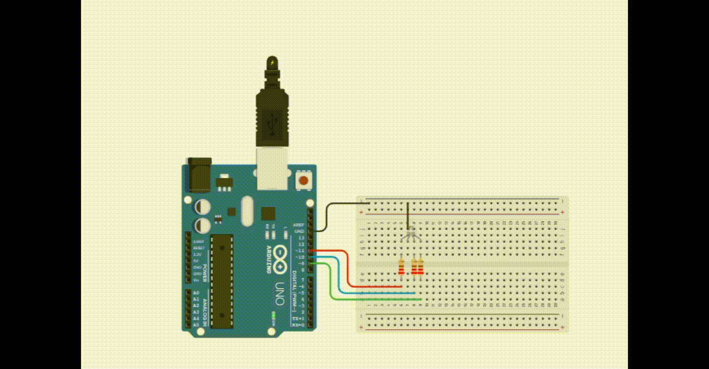

# Manipulando um LED RGB
 Este experimento consiste em fazer com que um LED RGB controlado pelas portas digitais 9, 10 e 11 (PMW) acendam de forma intermitente.

  <b><a href="https://www.tinkercad.com/things/6XM5ejGS2Jj">Clique Aqui</a></b> para ver o projeto em Tinkercard.com!
 
## Lista de componentes:

- 1  Arduíno UNO R3
- 1  Um cabo de conexão USB
- 1  Placa de prototipação (Protoboard)
- 1  LED RGB Cátodo
- 3  Resistor de 220 Ω ohms
- 5  Jumpers (macho-macho)

## Esquema do projeto

